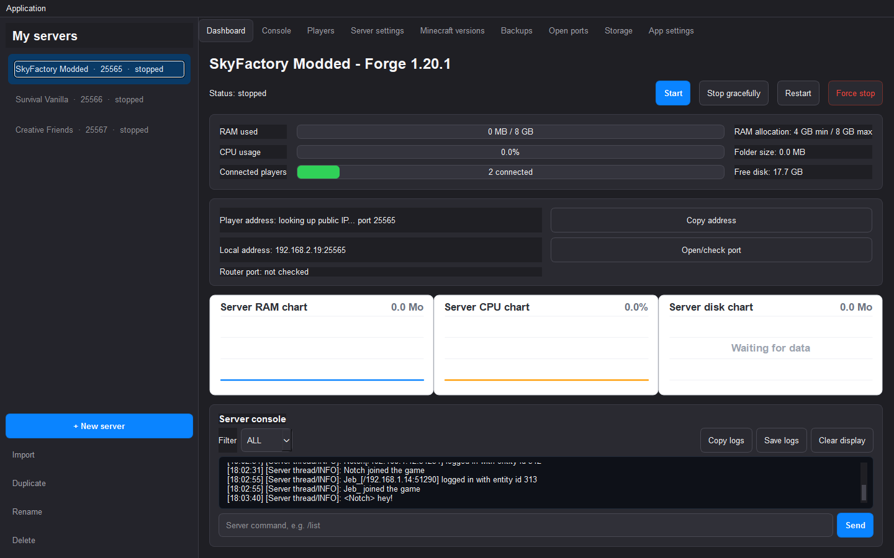
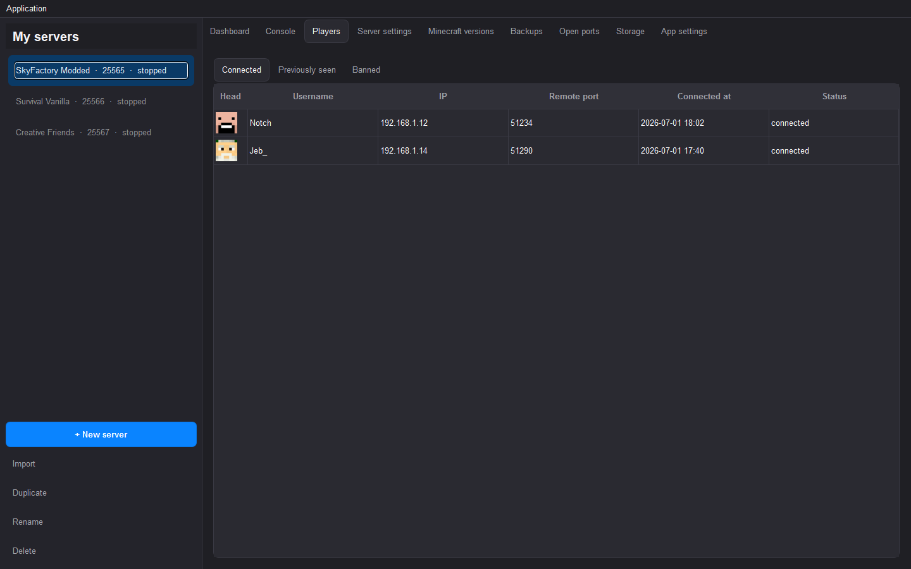
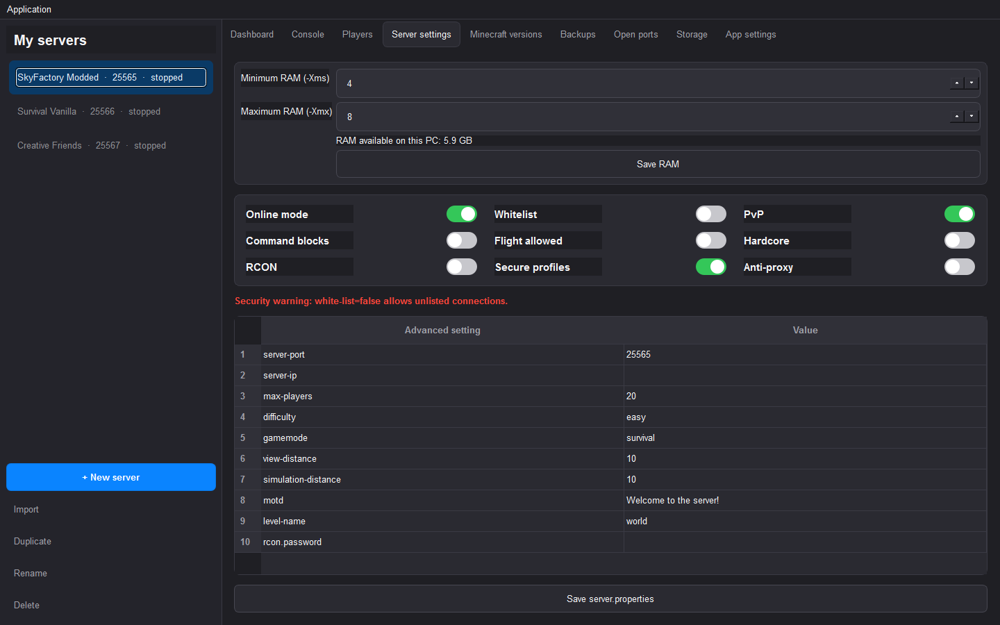

# Minecraft Server Manager

<p align="center">
  
</p>

<p align="center">
  <a href="https://www.python.org/"></a>
  <a href="https://pypi.org/project/PySide6/"></a>
  
  <a href="LICENSE"></a>
</p>

<p align="center">
  A cross-platform desktop application for managing multiple local Minecraft Java servers<br>
  from a single, responsive interface — Vanilla, Forge, NeoForge, Fabric and Quilt,<br>
  including CurseForge/Modrinth modpack imports.
</p>

<p align="center">
  
</p>

## Table of Contents

- [Why this project](#why-this-project)
- [Features](#features)
- [Screenshots](#screenshots)
- [Requirements](#requirements)
- [Getting started](#getting-started)
- [Building](#building)
- [Local data & privacy](#local-data--privacy)
- [Changelog](#changelog)
- [License](#license)

## Why this project

Running modded Minecraft servers locally usually means juggling terminal windows, manually editing `server.properties`, hunting down the right Java version, and resolving duplicate-mod crashes by hand. This app wraps all of that into a single native desktop tool:

- No external services or accounts required — everything runs and is stored locally.
- The Java process is fully managed by the app: no separate console window ever opens, all output is streamed into the UI.
- The UI stays responsive even while a heavily modded server (hundreds of mods) is starting up.

## Features

- **Server profiles** — create, import, duplicate, rename and delete profiles for Vanilla, Forge, NeoForge, Fabric and Quilt.
- **One-click lifecycle** — start, stop, restart and force-kill servers without ever opening a separate console window.
- **Automatic downloads** — fetches Vanilla/Forge server files and imports `.zip`/`.mrpack` modpacks with automatic modloader and Java version detection.
- **Managed Java runtime** — detects installed JDKs and can download the exact version required, per profile.
- **Duplicate mod detection** — scans and resolves conflicting mods in the background before every start.
- **Live console** — log-level filters, command input with autocompletion, copy/save/clear in one click.
- **Player tracking** — connected, previously seen and banned players, with avatars, moderation actions (op, kick, ban, whitelist) and join/leave notifications.
- **Real-time dashboard** — RAM, CPU, folder size and disk usage, with history charts.
- **Visual `server.properties` editor** with built-in security warnings.
- **Backups** — manual backup creation and one-click restore.
- **Networking tools** — LAN/public IP detection, automatic UPnP port opening, and a dedicated tab to review and close open router ports.
- **Light, dark and system themes.**
- **English, French and Spanish** interface.

## Screenshots

<p align="center">
  
  
</p>

## Requirements

- Python 3.9+
- A Java runtime matching your server's Minecraft version (the app can download one automatically if missing).
- An internet connection to download Vanilla/Forge server files and JDKs.

## Getting Started

```bash
python3 -m venv .venv
source .venv/bin/activate          # Windows: .venv\Scripts\activate
python -m pip install --upgrade pip
python -m pip install -r requirements.txt
python run.py
```

## Building

```bash
./scripts/build_macos.sh      # macOS, produces dist/Gestion Serveurs Minecraft.app
scripts\build_windows.bat     # Windows, produces dist/Gestion Serveurs Minecraft.exe
```

PyInstaller does not cross-compile, so the Windows build must be run on Windows and the macOS build must be run on macOS.

## Local data & privacy

All application data stays on the local machine — the app does not expose a web interface and does not transmit IP addresses, local paths or RCON credentials to any third party.

| Data | Location |
| --- | --- |
| Server profiles | Windows: `%APPDATA%\GestionServeursMinecraft\profiles.json`<br>macOS: `~/Library/Application Support/GestionServeursMinecraft/profiles.json` |
| Managed JDKs | Windows: `%APPDATA%\GestionServeursMinecraft\java\`<br>macOS: `~/Library/Application Support/GestionServeursMinecraft/java/` |
| Server files | The folder you choose when creating or importing a server |

## Changelog

See [CHANGELOG.md](CHANGELOG.md) for the full release history.

## License

Distributed under the [MIT License](LICENSE).
